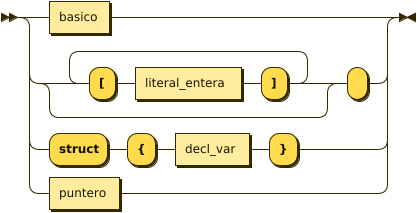
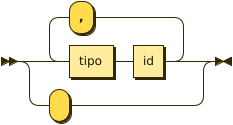
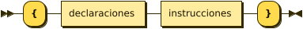

**programa:**


```
programa ::= ( proto tipo id '(' argumentos ')' ';' )* '' decl_var ( func tipo id '(' argumentos ')' bloque )* ''
```

**decl_var:**


```
decl_var ::= ( tipo id ( ',' id )* ';' )* ''
```

referenced by:

* programa
* tipo

**tipo:**



```
tipo     ::= basico
           | ( '[' literal_entera ']' )* ''
           | 'struct' '{' decl_var '}'
           | puntero
```

referenced by:

* argumentos
* decl_var
* programa

**puntero:**


```
puntero  ::= 'ptr' basico
```

referenced by:

* tipo

**basico:**


```
basico   ::= 'int'
           | 'float'
           | 'double'
           | 'complex'
           | 'rune'
           | 'void'
           | 'string'
```

referenced by:

* puntero
* tipo

**argumentos:**



```
argumentos
         ::= tipo id ( ',' tipo id )*
           | ''
```

referenced by:

* programa

**bloque:**



```
bloque   ::= '{' declaraciones instrucciones '}'
```

referenced by:

* programa
* sentencia

**instrucciones:**


```
instrucciones
         ::= sentencia+
```

referenced by:

* bloque
* caso
* predeterminado

**sentencia:**


```
sentencia
         ::= ( 'if' '(' exp ')' ( sentencia 'else' )? | 'while' '(' exp ')' ) sentencia
           | 'do' sentencia 'while' '(' exp ')'
           | ( 'break' | ( 'print' | parte_izquierda '=' ) exp | 'return' exp? ) ';'
           | bloque
           | 'switch' '(' exp ')' '{' caso* ( '' | predeterminado ) '}'
           | 'scan' parte_izquierda
```

referenced by:

* instrucciones
* sentencia

**caso:**


```
caso     ::= 'case' opcion ':' instrucciones
```

referenced by:

* sentencia

**opcion:**


```
opcion   ::= literal_entera
           | literal_runa
```

referenced by:

* caso

**predeterminado:**


```
predeterminado
         ::= 'default' ':' instrucciones
```

referenced by:

* sentencia

**parte_izquierda:**


```
parte_izquierda
         ::= id localizacion?
```

referenced by:

* sentencia

**localizacion:**


```
localizacion
         ::= ( '[' exp ']' )+
           | ( '.' id )+
```

referenced by:

* exp
* parte_izquierda

**exp:**


```
exp      ::= ( exp ( '||' | '&&' | '|' | '^' | '&' | '==' | '!=' | '<' | '<=' | '>=' | '>' | '<<' |
                  '>>' | '+' | '-' | '*' | '/' | '%' ) | '-' | '!' | '~' ) exp
           | '(' exp ')'
           | id ( localizacion | '(' parametros ')' )?
           | 'false'
           | 'true'
           | literal_entera
           | literal_runa
           | literal_flotante
           | literal_doble
           | literal_compleja
           | literal_cadena
```

referenced by:

* exp
* localizacion
* parametros
* sentencia

## 
 <sup>generated by [RR - Railroad Diagram Generator][RR]</sup>

[RR]: https://www.bottlecaps.de/rr/ui